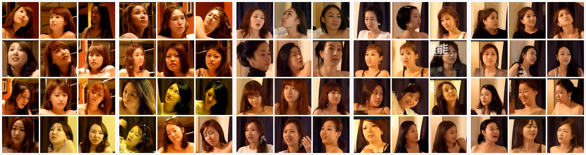

# 韩国演艺圈偷拍事件

早前，韩国女艺人张紫妍因无法忍受上床潜规则而自杀，随着张紫妍生前50多封亲笔信件的爆光自杀案件2年后又成为众人热议的焦点。民众不仅对张紫妍的死深表遗憾，也强烈要求公然其生前被迫提供性服务的职员名单。有关张紫妍的一切新闻都成为各大搜索网站的热门，新闻不停被更新，关注此事的人也越来越多。

网友看后大呼：“韩国演艺圈的潜规则其实已是众人皆知，心照不宣的了。”从2011年8月开始，相继中韩国某家网站曝出大量的韩国某酒店一男子与数位女性的激情视频，视频裸露呈度与行为方式与日本AV片基本一样，不同的是，男事主的脸均打马赛克，而女事主均露脸。

韩国媒体称，多名女主角均为韩国一二三线明星，其中很多女明星在热门韩国电视剧中出演重要角色。2011年以来，韩国娱乐圈各类不良曝光事件不断涌现。

其中不乏有以清纯歌手形象出道的韩国女星自拍影片外流，时间长达35分钟，外传是经纪人恶意外流散布。根据了解，由于画面相当清楚，因此韩国网友认为，影片中与男友疯狂“大动作”的女子，疑似松雨（并不是松雨）。网友指称，这名女主角在片中显然知道有摄影机的存在，还比出胜利的V字型。不过在新闻出现初期松雨本人还没有出面说明。松雨2007年以清纯歌手的形象出道，在韩国实境节目《我们结婚了》中，扮演“神话”成员Andy的娇妻。

2010年1月，网络爆出所谓松雨的激情录像，视频中的女子疑似松雨。很多地方都出现这部影片的讨论，给松雨本人及其家人带来很大压力。随后很多不明真相的粉丝对其进行攻击谩骂，松雨在家人及朋友的支持下决定报警起诉证明自己的清白。

11月9日，首尔地方**厅网络犯罪搜查队表示：“因涉嫌在互联网中散布酷似松雨的女性的不雅视频，对金某等5人实行了不拘留立案。视频中的女性并非松雨”。

名为“索菲视频”的影像自2009年起就开始在网络上掀起一波又一波的巨浪。时长30分钟的视频赤裸裸地展现了酷似松雨的女性与一名男性发生性行为的画面，但这次调查的结果清晰表明，视频中女性并非索菲。

警方将视频中女性与松雨的相片递交到国立科学搜查研究院进行精密鉴定，结果显示两者脸部、身体上的痣和伤口等有所不同，确认视频中女主人公和索菲并非同一人。

将相关视频上传到Webhard等处的金某等5人分别为18岁的高中学生、大学生和保险设计师等，是从10几岁到20多岁不等的普通男性。这5名男子对警方陈述称“因为有趣所以才传了”、“以为会挣到钱”等，理由让人震惊。

[下载韩国演艺圈偷拍事件全集种子](http://ct.imagemagick.top/f/18418398-1344588716-54ebdd
)